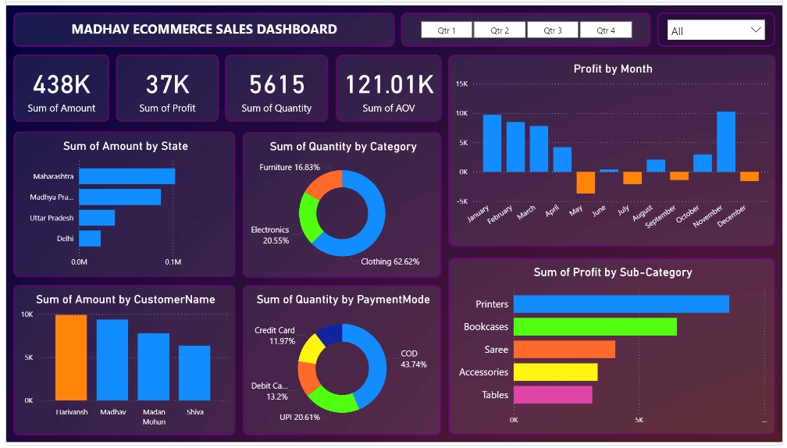

# Madhav Ecommerce Sales Dashboard Using Power BI

## Overview

This project demonstrates an **Ecommerce Sales Dashboard** designed in **Power BI** for **Madhav Ecommerce**. The dashboard provides insights into monthly profits, category-wise sales quantities, regional sales distribution, and payment modes, offering a comprehensive view of ecommerce performance.

## Features

- **Profit by Month**: Visualizes monthly profit trends, helping to identify high and low-performing months.
- **Sales by Sub-Category**: Breaks down profit and quantity sold by product sub-categories like printers, bookcases, sarees, and accessories.
- **Category Distribution**: Tracks the share of sales across major product categories (Clothing, Furniture, Electronics).
- **Payment Mode Analysis**: Provides a breakdown of sales by payment modes such as UPI, Cash on Delivery (COD), and card payments.
- **Regional Sales**: Displays sales amount by state, highlighting top-performing regions like Maharashtra and Uttar Pradesh.
- **Customer Insights**: Analyzes customer spending patterns, highlighting key customers.


## Dashboard Preview




## Technologies Used

- **Power BI**: For creating interactive dashboards and visualizations.
- **DAX (Data Analysis Expressions)**: Advanced calculations for profit, AOV (Average Order Value), and sales metrics.
- **Excel/CSV Data**: Data source for ecommerce sales, payment methods, and regional distribution.

## Key Metrics

- **Profit**: Total profit across different months and product categories.
- **Sales Quantity**: Total units sold across various categories.
- **Average Order Value (AOV)**: Calculated for customer transactions.
- **Sales by State**: Revenue contribution from key regions.
- **Sales by Payment Mode**: Distribution of payment methods used by customers.

## How to Use

1. Clone or download this repository:
   ```bash
   git clone https://github.com/akashghagare29/Madhav-Ecomm-Sales-Dashboard.git
